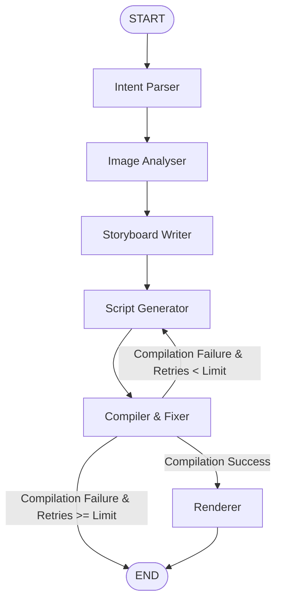

# FotoOwl AI — Image-to-Video Multiagent Pipeline

An automated multiagent pipeline orchestrated with **LangGraph** that takes a folder of images and a creative brief prompt, processes them through a series of specialized AI agents, and outputs a compiled and rendered **Remotion** video reel.

---

## 1. Pipeline Architecture

The pipeline consists of five specialized agents working on a shared typed state, implementing a conditional compilation loop.



### Shared State Object (`AgentState`)
All agents read from and write to a typed state dictionary mapping:
*   `user_prompt`: The input creative brief text.
*   `image_paths`: Absolute paths of raw input images.
*   `video_intent`: Structured intent parsing output (pacing, colors, fonts, transition).
*   `image_analyses`: Visually analyzed details (subject, colors, mood, quality score).
*   `selected_images`: Chronologically ordered subset of images selected for the final reel.
*   `storyboard`: Structured narrative slides (caption, duration, transition type, font sizes/colors).
*   `remotion_script`: Compiled TypeScript React slideshow component code.
*   `compile_errors`: List of tracebacks from failed compilation attempts.
*   `retry_count` / `max_retries`: Safe retry limits.
*   `status`: Track pipeline states ("success", "compile_failed", etc.).

---

## 2. Multi-Model Routing Rationale

Different LLM models are routed based on cost, latency, and reasoning complexity:

| Agent Node | Model Name | Motivated Rationale |
| :--- | :--- | :--- |
| **Intent Parser** | `gemini-1.5-flash` | **Cost/Speed**: Simple classification and parsing task. Extremely fast and cheap. |
| **Image Analyser** | `gemini-1.5-flash` | **Vision/Speed**: Flash has native vision capabilities, processing multiple image frames at low cost and sub-second latencies. |
| **Storyboard Writer** | `gemini-1.5-pro` | **Intelligence**: Building a coherent storytelling arc and assigning aesthetic attributes requires advanced narrative reasoning. |
| **Script Generator** | `gemini-1.5-pro` | **Coding**: Generating bug-free TypeScript React code with precise frame offsets requires high logical reasoning. |
| **Compiler & Fixer** | `gemini-1.5-pro` | **Reasoning**: Parsing error stack traces and cross-referencing documentation snippets for a targeted fix requires deep debugging intelligence. |

*Note: All LLM calls return structured JSON conforming to Pydantic schemas using native SDK structured outputs (`response_schema`).*

---

## 3. RAG Layer Design Decisions

The pipeline seeds a local **Qdrant** database (in-memory) with style guidelines and Remotion API references.

### Collections & Chunking Strategy
1.  **`style_guides` Collection**:
    *   **Documents**: Stylistic details for different templates (Cinematic, Upbeat, Corporate).
    *   **Chunking**: *One style guide = one chunk*. Since each guide is short (150-200 words), keeping them complete ensures that the Storyboard Writer receives intact aesthetic directions (fonts, colors, pacing).
2.  **`remotion_api` Collection**:
    *   **Documents**: Reference descriptions and example snippets for Remotion functions (`<Composition>`, `<Sequence>`, `useCurrentFrame`, `interpolate`, `spring`, ``).
    *   **Chunking**: *One API function = one chunk*. Chunking by function ensures that the Script Generator and Compiler retrieve only the code snippets relevant to the transition type or compilation error they are handling, preventing context clutter.

### Retrieval Approach
*   **Vector Embeddings**: Generates 768-dimension vectors.
    *   *Real Mode*: Uses Gemini's `models/text-embedding-004` when API key is active.
    *   *Offline Fallback*: Deterministic local Term Frequency (TF) bag-of-words vectorizer.
*   **Error Search**: On compile fail, the compiler logs the exact error statement (e.g. `ReferenceError: Img is not defined`), querying the vector store to retrieve the relevant API block to feed back into the script generator.

---

## 4. Setup and Run Instructions

### Prerequisites
*   **Python**: Version `3.11` or `3.12`
*   **Node.js**: (Optional, for rendering actual MP4s. If missing, the pipeline runs in **Mock/Validation Mode**, checking syntax and writing outputs successfully).

### Installation
1.  Navigate to the project directory:
    ```powershell
    cd C:\Users\Bharati\.gemini\antigravity\scratch\fotoowl-pipeline
    ```
2.  Create and activate a virtual environment:
    ```powershell
    python -m venv venv
    # Windows:
    .\venv\Scripts\Activate.ps1
    ```
3.  Install dependencies:
    ```powershell
    pip install -r requirements.txt
    ```
4.  *(Optional)* Create a `.env` file from the example:
    ```powershell
    copy .env.example .env
    ```
    Add your `GEMINI_API_KEY` to run with live models. If left empty, the pipeline executes in mock mode using deterministic structured fallbacks.

### Running the Demo
Generate mock image files and run both **Cinematic Wedding** and **Upbeat Birthday** demos:
```powershell
python run_demo.py
```
This generates the outputs in:
*   `sample_output/wedding/`: Cinematic outputs (slow pacing, serif font, soft crossfade transitions).
*   `sample_output/birthday/`: Upbeat outputs (fast pacing, bold sans-serif font, zoom transitions).

### Running on Custom Images
Run the CLI entry point directly:
```powershell
python run_pipeline.py --images_dir "/path/to/photos" --prompt "Clean corporate highlights, professional tone, subtle transitions"
```

### Running Tests
Execute the unit test suite covering mock tests, storyboards, LLM-as-judge evaluation, and the compiler retry loop:
```powershell
python -m unittest test_pipeline.py
```

---

## 5. Walkthrough & Output Analysis

Reviewing the generated outputs under `sample_output/wedding/` and `sample_output/birthday/` demonstrates prompt influence on the pipeline:

### Cinematic Wedding Reel (`sample_output/wedding/`)
*   **Pacing**: 5.0 seconds per slide (`durationFrames: 150`).
*   **Transitions**: Soft crossfades of 1.0 second (`transitionFrames: 30`, `transitionType: 'fade'`).
*   **Styling**: Elegant serif font (`Playfair Display`), soft font colors (`#fdfbf7`), emotional and romantic captions.

### Upbeat Birthday Reel (`sample_output/birthday/`)
*   **Pacing**: 1.5 seconds per slide (`durationFrames: 45`).
*   **Transitions**: Quick scale transitions of 0.3 seconds (`transitionFrames: 9`, `transitionType: 'zoom'`).
*   **Styling**: Heavy display font (`Impact`), vibrant primary yellow text overlay (`#ffcc00`), punchy captions.

---

## 6. Known Limitations & Future Improvements

1.  **Audio Integration**: Currently, the pipeline focuses purely on video frames. Future versions should query the vector store for audio track styling and use Remotion's `<Audio>` API, aligning transitions to audio beats (onset detection).
2.  **Asset Resizing**: The Image Analyser currently downsizes images to 512x512 for vision reasoning. Adding a smart aspect ratio cropping model prior to compiling would prevent stretch issues during rendering.
3.  **Local Node compiler packaging**: Integrating a lightweight portable Node distribution would allow end-to-end rendering on target machines without requiring manual Node.js pre-installation.
